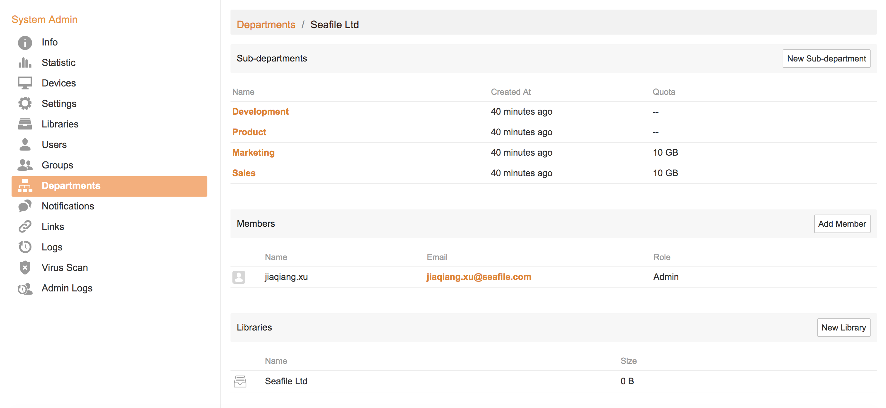

# Managing and Using Departments

Some organizations consist of complex department hierarchy. There are usually two common use cases for file management in these organizations:

- There should be a common file sharing space for the organization. The folder hierarchy should map the department hierarchy. There will be separate folder or space assigned to each department.
- The sharing space should be owned and managed by the organization, but not individual employees. So that the ownership of files doesn't have to be changed when an employee leaves the organization.

Before version 6.3.0, files in Seafile can only be owned by individual users and shared to other users or groups. In 6.3.0, we introduce the "Departments" feature to meet the above two use cases. This new feature works side by side with the existing sharing features.

We'll introduce this feature from 3 different perspectives:

- [System admin](#wiki-sys-admin)
- [Department admin](#wiki-dept-admin)
- [Department members](#wiki-user)

## <h2 id='wiki-sys-admin'>System Admin</h2>

The system admin can:

- Manage department hierarchy and members
- Assign storage quota for departments
- Create and manage shared libraries in departments

### Manage department hierarchy and members

The system admin can setup the department hierarchy in two ways: manual setup or import from Active Directory.

The system admin can create any number of top level departments and create any levels of sub-departments under each department. And each level of department can be populated with members. The system admin can set the role of each member to 'member' or 'admin'. We'll introduce how can a department admin manage department later.

The system admin can also import the hierarchy from OUs (Organizational Units) in AD. Please refer to "Sync OU to departments" section in [LDAP Group Sync documentation](https://manual.seafile.com/deploy_pro/ldap_group_sync.html). Each OU will be imported as a department. And the sub-OUs under an OU will be imported as sub-departments. Department libraries can be automatically created in the import process.

System admin can also delete a department after all the sub-departments and libraries are deleted.

### Assign Storage quota for departments

The file libraries created inside a department are owned by the department itself, not by any individual user. So the system admin can assign storage quota to a department. The total size of all the libraries in a department cannot exceed the storage quota. **Please note that the quota of sub-department doesn't depend on the quota of its parent department.**

### Create and Manage shared libraries in departments

Unlike groups, libraries owned by individual users cannot be shared to a department. Department libraries can only be created by the system admin or department admin. This is for the purpose for more consolidated control of the libraries.

All the above operations can be done in the system admin interface. See the below screenshot for information.

## <h2 id='wiki-dept-admin'>Department Admin</h2>

As noted above, department admin is a special role assigned by the system admin to some members of a department. Department admins can perform the following operations in a department after login to his/her own account.

- Access to the libraries of the department
- Manage members in his/her department
- Manage libraries in his/her department

For the end users, a department can be accessed as a special type of group. Each department is presented to its members as a group. A user can not only access to the libraries in the department he/she belongs to, but also the libraries in the parent departments of his/her department. For example, if John is in the "EMEA" sub-department under the "Sales" department, and "Sales" is a sub-department under the company "ACME", John can then access to the groups "EMEA", "Sales" and "ACME". The groups for departments are marked with a "building" icon next to its name. See the screenshot below for details.

If a user is the admin of a department, he/she can add or delete members in the department. Any users registered in the system can be added as member of the department. But if the departments are imported from AD, the changes to membership will be overwritten on the next sync with AD.

Department admin can manage the libraries in the department. The supported operations are:

- Create or delete library
- Change library name
- Share a library to users or groups outside of this department. This is very useful for cross-department collaboration.
- Set fine-grained permission to folders in the libraries for users or sub-departments in this department. This works like the [folder permission feature](./folder_permission.md).

## <h2 id='wiki-user'>Department Members</h2>

A normal member of the department can use the department just like a group. Each department is presented to its members as a group. A user can not only access to the libraries in the department he/she belongs to, but also the libraries in the parent departments of his/her department. For example, if John is in the "EMEA" sub-department under the "Sales" department, and "Sales" is a sub-department under the company "ACME", John can then access to the groups "EMEA", "Sales" and "ACME". The groups for departments are marked with a "building" icon next to its name.

The only difference from groups is that, libraries owned by a user cannot be shared to a department group.
